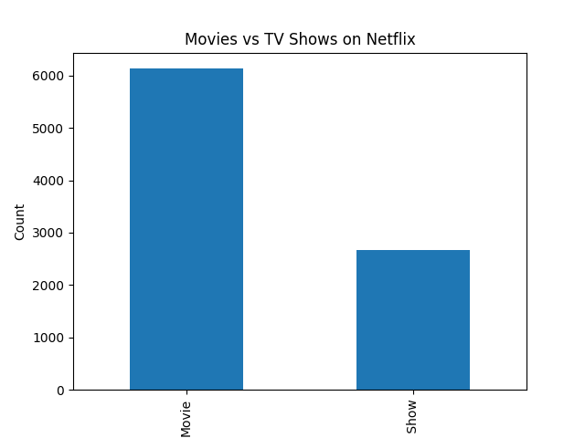
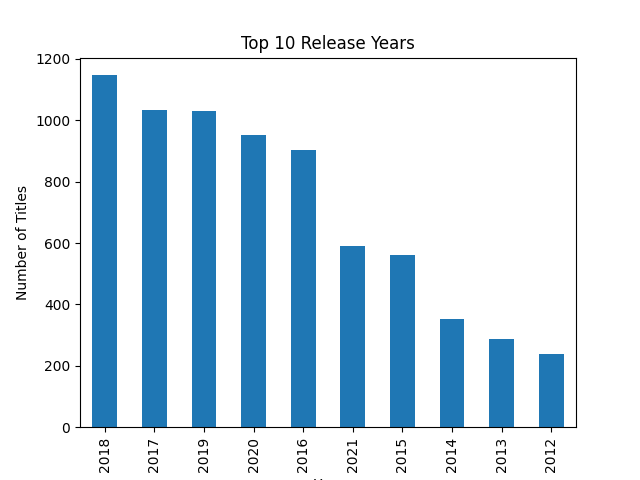
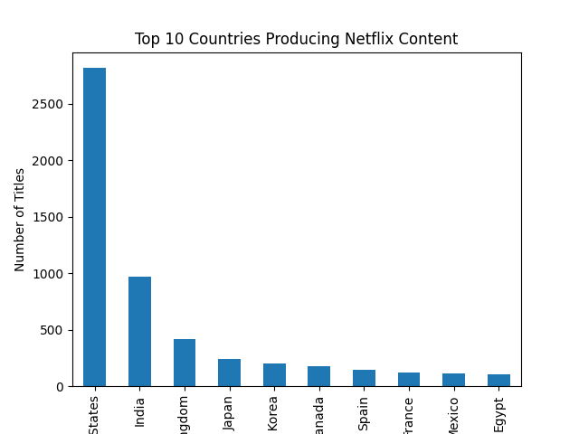

 Netflix Data Analysis 

This project performs Exploratory Data Analysis (EDA) on the Netflix dataset using Python.

 Tools Used
- Python
- Pandas
- Matplotlib

 Analysis Performed
- Movies vs TV Shows comparison
- Top release years
- Countries producing the most Netflix content

 Sample Visualizations
 
 1.Movies vs TV Shows
   

 2. Top Release Years
   

3.Top Countries
  

 How to Run

1. Download the repository
2. Install required libraries

